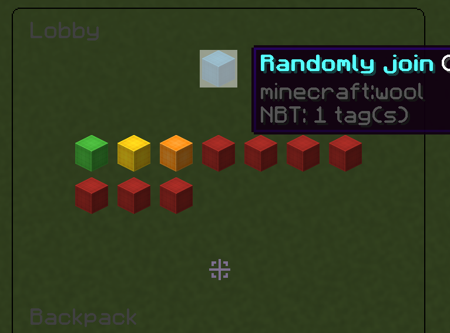

# ServerConnector

> This is a Bukkit plugin that makes it easier to integrate with other BungeeCord servers

<picture>
    
</picture>

### Information:
 - The remade version of [ServerJoiner](https://www.spigotmc.org/resources/serverjoiner.53694)
 - Theoretically supports all Minecraft versions

### Commands:
 - /connector <GroupName> Open the specified group selection menu
 - /connector join <ServerName> Join the specified server
 - /connector random_join <GroupName> Join a server randomly from the specified server group

### Permissions:
- connector.*
- connector.join
- connector.random-join
- connector.open-gui
